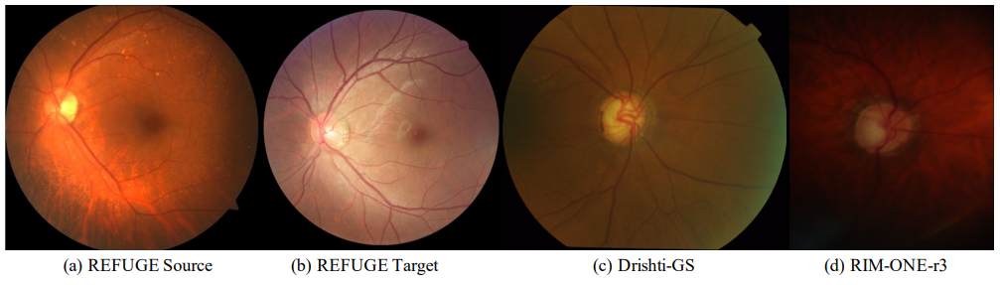
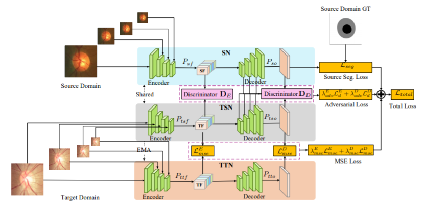
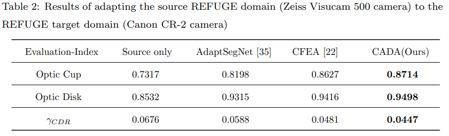
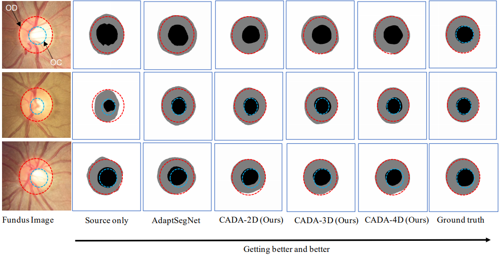

# CADA
Multi-scale Collaborative Adversarial Domain Adaptation for Unsupervised Optic Disc and Cup Segmentation

### Pytorch implementation of CADA.

This is a Pytorch implementation of the paper "Multi-scale Collaborative Adversarial Domain Adaptation for Unsupervised Optic Disc and Cup Segmentation". 

### Requirements

* Python 3.6
* Python 1.0.0
* Albumentations

A working environment can be obtained by running conda create -f packages.yml. Edit the header title of the yml file and the end line to your discretion.

## 1. Abstract

Recently, deep neural networks have demonstrated comparable and even better performance than 
board-certified ophthalmologists in well-annotated datasets. However, the diversity of retinal 
imaging devices poses a significant challenge: domain shift, which leads to performance 
degradation when applying the deep learning models trained on one domain to new testing 
domains. In this paper, we propose a multi-scale input along with multiple domain adaptors applied 
hierarchically in both feature and output spaces. The proposed training strategy and novel 
unsupervised domain adaptation framework, called Collaborative Adversarial Domain Adaptation 
(CADA), can effectively overcome the challenge. Multi-scale inputs can reduce the information 
loss due to the pooling layers used in the network for feature extraction, while our proposed CADA 
is an interactive paradigm that presents an exquisite collaborative adaptation through both 
adversarial learning and ensembling weights at different network layers. In particular, in order to 
produce a better prediction for the unlabeled target domain data, we simultaneously achieve 
domain-invariance and model generalizability via adversarial learning at multi-scale outputs from 
different levels of network layers and maintaining an exponential moving average (EMA) of the 
historical weights during training. Without annotating any sample from the target domain, multiple 
adversarial losses in encoder and decoder layers guide the extraction of domain-invariant features 
to confuse the domain classifier. Meanwhile, the ensembling of weights via EMA reduces the 
uncertainty of adapting multiple discriminator learning. Comprehensive experimental results 
demonstrate that our CADA model incorporating multi-scale input training can overcome 
performance degradation and outperform state-of-the-art domain adaptation methods in 
segmenting retinal optic disc and cup from fundus images stemming from the REFUGE, Drishti-GS, and Rim-One-r3 datasets.

## 2. Domain shift 



## 3. Network Structure


 
## 4. Training and testing
### 1.  Download the data https://refuge.grand-challenge.org 
* REFUGE: https://refuge.grand-challenge.org
* Drishti-GS: https://cvit.iiit.ac.in/projects/mip/drishti-gs/mip-dataset2/Home.php
* Rim-One-r3: https://medimrg.webs.ull.es/research/retinal-imaging/rim-one/

Pre-process the original images by running src/data_preprocess/generate_ROI.py. 

## 2. Directories
* For data loading, in REFUGE.py, change the directories for the source, target, and testing domains, for both the image and masks
* For training, in arguments.py, change the directories for tensorboard and model weights. 
* For testing, in predict.py, change the model weights and model results directories.

### 3. Train the model:
 
   ```shell
   cd src
   python CADA.py
   ```
### 4. Predict the masks:

   ```shell
   python predict.py
   ```
## 5. Unsupervised Segmentation Results

### 1. Results of adapting source to target

 
 
### 2. The visual examples of optic disc and cup segmentation


## 6. Citation

## 7. Questions

Further questions, please feel free to contact `pliu1 at ufl.edu` , `charlietran at uncc.edu` , or `bkong at uncc.edu` or 
